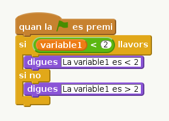

# Apunts a la traducció catalana

El filtre *pandoc-scratchblocks* és una extensió pel programa [pandoc](www.pandoc.org) que permet incloure blocs d'Scratch en format text dins 
dels fitxers de les pràctiques. Durant la generació del codi html des dels fitxers .md (veure com a [Lession Formatter](https://github.com/codeclubcat/lesson_format)), els blocs de codi es transformen en imatges inserides dins de les pàgines html. Per exemple:

```scratch
   si < ((variable1) < (2))  i  ((variable2) > (4))  >  llavors
	   digues [hola mon]
   fi
```

es tradueix en la imatge:




# Traducció dels blocs

Quan s'escriuen els blocs a dins de les pràctiques en format markdown, aquests han d'estar sempre encapçalats de la mateixa forma que si es tractés de codi en algun altre llenguatge. Així, tots els blocs estaran encapçalats per:

```

	```scratch
		...
		...
		...
	```
  
```

La traducció de cada un dels blocs queda com s'indica a continuació. Els simbols a dins de cada bloc indiquen:

* `( )` s'insereix o bé un nombre o una variable
* `[ ]` s'insereix un cadena de caràcters
* `[... v]` o `(... v)` s'insereix un atribut amb múltiples opcions (un desplegable amb les lletres, etcètera...)


## Blocs de moviment:

``` 
"mou-te ( ) passos" 
"gira a l'esquerra ( ) graus"
"gira a la dreta ( ) graus"
"apunta en direcció (... v)" 
"apunta cap a [... v]"
"vés a x: ( ) y: ( )" 
"vés a [... v]"
"llisca en ( ) segons fins a x: ( ) y: ( )" 
"suma ( ) a x"
"assigna el valor ( ) a x" 
"suma ( ) a y" 
"assigna el valor ( ) a y" 
"rebota en tocar una vora" 
"fixa la rotació a [... v]" 
"posició x" 
"posició y" 
"direcció"
```

## Blocs d'aspecte: 
```
"digues [ ] durant ( ) segons"
"digues [ ]"
"pensa [ ] durant ( ) segons" 
"pensa [ ]"
"mostra"
"amaga" 
"canvia el vestit a [... v]" 
"següent vestit" 
"canvia el fons a [... v]"
"augmenta l'efecte [... v] en ( )"
"fixa l'efecte [... v] a ( )"
"treu els efectes gràfics"
"augmenta ( ) la mida"
"fixa la mida a ( ) %" 
"vés al front"
"vés ( ) capes darrera"
"vestit nr"
"nom del fons"
"mida"
"canvia el fons a [... v] i espera"
"següent fons de pantalla"
"fons nr"
"canvia el fons a _"
"següent fons de pantalla"
"fons #"
```

## Bloncs de sons:

```
"toca el so [... v]" 
"toca el so [... v] fins que acabi" 
"atura tots els sons" 
"toca el tambor (... v) durant ( ) pulsacions" 
"fes silenci durant ( ) pulsacions" 
"toca la nota (... v) durant ( ) pulsacions" 
"fixa l'instrument a  (... v)" 
"puja ( ) el volum" 
"fixa el volum a  ( ) %" 
"volum" 
"augmenta ( ) el tempo" 
"fixa el tempo a ( )" 
"tempo" 
"neteja" 
"estampa" 
```

## Blocs del llapis:
```
"baixa el llapis" 
"puja el llapis" 
"fixa el color del llapis a [ ]" 
"augmenta ( ) el color del llapis" 
"fixa el color del llapis a  ( )" 
"augmenta ( ) la intensitat del llapis" 
"fixa la intensitat del llapis a ( )" 
"augmenta ( ) la mida del llapis" 
"fixa la mida del llapis a ( )" 
```

## Blocs de dades:

### Variables
```
"assigna a [... v] el valor [ ] " 
"augmenta [... v]  en ( )" 
"mostra la variable [... v]" 
"amaga la variable [... v]",
 ```
 
### Llistes
```
"afegeix [ ] a [... v]" 
"esborra l'element (... v) de [... v]" 
"afegeix [ ] a la posició (... v) de [... v]" 
"canvia l'element (... v) de [... v] per [ ]" 
"element (... v) de [... v]" 
"llargada de [... v]" 
"[... v] conté [ ]" 
"mostra la llista [... v]" 
"amaga la llista [... v]",
```

## Blocs d'esdeveniments:
``` 
"quan la @ es premi" 
"quan la tecla [... v] es premi" 
"quan es cliqui aquest personatge" 
"quan l'escenari canviï al fons [... v]" 
"quan [... v] > ( )" 
"quan rebi [... v]" 
"envia a tots [... v]" 
"envia a tots [... v] i espera" 
```

## Blocs de control:
```
"espera ( ) segons" 
"repeteix ( ) vegades", 
"per sempre"
"si < > llavors"
"si no", 
"fi" 
"espera fins < >" 
"repeteix fins  < >" 
"atura [... v]" 
"quan una còpia meva comenci" 
"crea una còpia de [... v]" 
"esborra aquesta còpia" 
```

## Blocs de sensors:

"tocant [...v] ?" 
"tocant el color  [ ]?" 
"color [ ] sobre [ ]?" 
"distància a [... v]" 
"pregunta [ ] i espera" 
"resposta" 
"tecla [... v] premuda?" 
"ratolí clicat?" 
"ratolí x" 
"ratolí y" 
"volum del so" 
"[... v] de vídeo a [... v]" 
"posa vídeo [... v]" 
"fixa la transparència del vídeo a ( ) %" 
"cronòmetre" 
"reinicia el cronòmetre" 
"[... v] de [... v]" 
"[... v] actual" 
"dies des del 2000" 
"nom d'usuari" 
"so fort?"
```

## Operadors:
```
"nombre a l'atzar entre ( ) i ( )"
"( ) i  ( ) " 
"( ) o  (  )" 
"no ( )" 
"uneix ( ) i _" 
"lletra ( ) de [ ]" 
"llargada de [ ]" 
"residu de dividir ( ) entre ( )" 
"arrodoneix ( )" 
"[... v ] de ( )"
```

# Ús dels blocs amb bucles

Els blocs que permeten fer bucles com `si < > llavors` o `per sempre` s'han de tancar utilitzant el bloc `fi`. Per exemple:

```scratch
   si < ((variable1) < (2))  i  ((variable2) > (4))  >  llavors
	   digues [hola mon]
   fi
```


